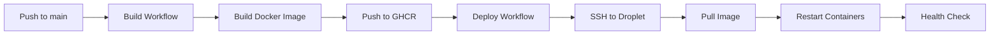

# CI/CD Configuration

This document describes the continuous integration and deployment setup for Snippy Backend.

## Overview

The project uses two main workflows:
1. **Build and Push** - Builds Docker images on GitHub infrastructure
2. **Deploy** - Deploys pre-built images to DigitalOcean droplet

This approach **saves your droplet's resources** by building in the cloud instead of on your server.

## Build and Push Workflow

### How It Works

**File**: `.github/workflows/build.yml`

**Triggers**:
- Push to `main` branch
- Manual workflow dispatch

**Process**:
1. Checks out code
2. Logs in to GitHub Container Registry (GHCR)
3. Builds Docker image using GitHub's infrastructure
4. Pushes image to `ghcr.io/jheysaaz/snippy-backend:latest`
5. Uses layer caching for faster subsequent builds

**Benefits**:
- ✅ Free builds using GitHub's powerful servers
- ✅ No resource usage on your droplet
- ✅ Fast builds with caching
- ✅ Automatic versioning with SHA tags

### Required Permissions

The workflow uses `GITHUB_TOKEN` (automatically provided) with these permissions:
- `contents: read` - Read repository code
- `packages: write` - Push to GitHub Container Registry

## Deployment Workflow

### How It Works

**File**: `.github/workflows/deploy.yml`

**Triggers**:
- After successful completion of Build and Push workflow
- Manual workflow dispatch

**Process**:
1. Waits for build workflow to complete successfully
2. SSH into your DigitalOcean droplet
3. Pulls latest code from GitHub
4. Logs in to GHCR
5. Pulls the pre-built Docker image
6. Runs `deploy.sh` to restart containers
7. Verifies API health

**Benefits**:
- ✅ Droplet only pulls and runs (no building)
- ✅ Fast deployment (~30 seconds)
- ✅ Automatic health checks
- ✅ Works on small droplets (512MB-1GB)

### Required GitHub Secrets

Add these in: **Settings → Secrets and variables → Actions**

| Secret Name | Description | Example |
|-------------|-------------|---------|
| `DROPLET_HOST` | Droplet IP address | `164.92.xxx.xxx` |
| `DROPLET_USERNAME` | SSH username | `root` |
| `DROPLET_SSH_KEY` | Private SSH key | Contents of `~/.ssh/id_rsa` |
| `DROPLET_PORT` | SSH port (optional) | `22` |
| `GHCR_TOKEN` | GitHub Personal Access Token | `ghp_xxx...` |

### Creating GHCR_TOKEN

1. Go to: **GitHub Settings → Developer settings → Personal access tokens → Tokens (classic)**
2. Click **"Generate new token (classic)"**
3. Name: `Snippy Backend GHCR`
4. Expiration: Choose duration (recommend 1 year)
5. Select scopes:
   - ✅ `write:packages`
   - ✅ `read:packages`
   - ✅ `delete:packages`
6. Click **"Generate token"**
7. **Copy the token immediately** (you won't see it again!)
8. Add to repository secrets as `GHCR_TOKEN`

## Droplet Setup

### One-Time Docker Registry Authentication

SSH into your droplet and authenticate with GHCR:

```bash
# SSH into droplet
ssh root@your-droplet-ip

# Log in to GitHub Container Registry
echo "YOUR_GITHUB_TOKEN" | docker login ghcr.io -u YOUR_GITHUB_USERNAME --password-stdin
```

This creates `~/.docker/config.json` with auth credentials that persist across deployments.

### Project Setup on Droplet

```bash
# Clone repository (if not already done)
cd /root
git clone https://github.com/jheysaaz/snippy-backend.git
cd snippy-backend

# Create production environment file
cp .env.example .env.production
nano .env.production  # Edit with your settings

# Make deploy script executable
chmod +x deploy.sh

# Initial deployment
./deploy.sh production
```

## Resource Requirements

### Before (Building on Droplet)
- **Required**: 2GB+ RAM, 2 CPU
- **Cost**: $12-18/month
- **Build Time**: 3-5 minutes
- **Freezing**: Common on small droplets

### After (Building on GitHub)
- **Required**: 512MB-1GB RAM, 1 CPU
- **Cost**: $4-12/month
- **Deploy Time**: 30 seconds
- **Freezing**: None! 🎉

**Savings**: $6-8/month + Better performance

## Deployment Files

### docker-compose.yml

Updated to use pre-built image:

```yaml
services:
  api:
    image: ghcr.io/jheysaaz/snippy-backend:latest  # Pull from registry
    # No build section - image is pre-built
```

### deploy.sh

Updated to skip building:

```bash
# OLD: Build on droplet (slow, resource-intensive)
# docker-compose build

# NEW: Just pull pre-built image (fast, minimal resources)
docker-compose pull
```

## Workflow Sequence



## GitHub Actions Workflows

### CI Workflow (`.github/workflows/ci.yml`)

Runs automatically on:

- Push to `main` or `develop` branches
- Pull requests to `main` or `develop` branches

#### Jobs

**1. Test Job**

- Runs all Go tests with race detection
- Uses PostgreSQL 16 service container
- Generates code coverage report
- Uploads coverage to Codecov
- **Duration**: ~2-3 minutes

**2. Security Job**

- Runs `gosec` security scanner
- Uploads results to GitHub Security tab (SARIF format)
- Runs `govulncheck` for dependency vulnerabilities
- **Duration**: ~1-2 minutes

**3. Format Job**

- Checks code formatting with `gofmt`
- Runs `golangci-lint` with 20+ linters
- **Duration**: ~2-3 minutes

**4. Build Job**

- Builds the application
- Creates downloadable artifact
- Only runs if all other jobs pass
- **Duration**: ~1 minute

**Total CI Time**: ~5-8 minutes

## Local Development Commands

### Make Commands

```bash
# Quick checks
make format        # Auto-format code
make format-check  # Check if formatted
make lint          # Run linter
make test          # Run tests
make security      # Run security scans
make build         # Build application

# Comprehensive check
make all           # Run all checks + build

# Utilities
make test-coverage # Generate HTML coverage report
make clean         # Remove build artifacts
make help          # Show all commands
```

### Manual Commands

```bash
# Format code
gofmt -s -w .

# Check format
test -z "$(gofmt -s -l .)"

# Run linter
golangci-lint run --timeout=5m

# Security scans
gosec ./...
govulncheck ./...

# Tests
go test -v -race ./...
go test -v -race -coverprofile=coverage.out ./...

# Build
go build -v -o snippy-backend .
```

## Git Hooks

### Pre-commit Hook

Automatically runs before each commit:

1. Code format check
2. Fast linter checks
3. Unit tests

**Install**: `ln -s ../../.githooks/pre-commit .git/hooks/pre-commit`

**Bypass** (not recommended): `git commit --no-verify`

## Linter Configuration

### golangci-lint (`.golangci.yml`)

Enabled linters (20+):

- `errcheck` - Unchecked errors
- `gosimple` - Code simplification
- `govet` - Suspicious constructs
- `ineffassign` - Ineffectual assignments
- `staticcheck` - Static analysis
- `unused` - Unused code
- `gosec` - Security issues
- `gofmt` - Code formatting
- `goimports` - Import formatting
- `misspell` - Spelling errors
- `bodyclose` - HTTP response body closure
- `sqlclosecheck` - SQL resource cleanup
- `revive` - Go linting rules
- And more...

### Configuration Highlights

- Cyclomatic complexity limit: 15
- Type assertions checked
- Blank error returns checked
- All vet checks enabled
- Medium severity for security issues

## Security Scanning

### gosec

Scans for common security issues:

- SQL injection
- File path injection
- Weak crypto
- Hardcoded credentials
- And more...

Results are uploaded to GitHub Security tab.

### govulncheck

Checks dependencies for known vulnerabilities:

- CVE database
- Go vulnerability database
- Direct and transitive dependencies

## Code Coverage

- Coverage reports generated on every test run
- Uploaded to Codecov for tracking
- Viewable in PR comments
- Historic trends available

Target: Maintain >80% coverage

## CI Badges

Add to README:

```markdown
[](https://github.com/jheysaaz/snippy-backend/actions/workflows/ci.yml)
[](https://goreportcard.com/report/github.com/jheysaaz/snippy-backend)
[](https://codecov.io/gh/jheysaaz/snippy-backend)
```

## Troubleshooting

### CI Failures

**Test Job Fails**

- Check PostgreSQL connection
- Review test logs
- Run locally: `make test`

**Security Job Fails**

- Review gosec output
- Check for new vulnerabilities
- Run locally: `make security`

**Format Job Fails**

- Run `make format` to auto-fix
- Run `make lint` to check locally
- Fix reported issues

**Build Job Fails**

- Check for compilation errors
- Verify all dependencies
- Run locally: `make build`

### Local Development Issues

**Linter not found**

```bash
curl -sSfL https://raw.githubusercontent.com/golangci/golangci-lint/master/install.sh | sh -s -- -b $(go env GOPATH)/bin
```

**gosec not found**

```bash
go install github.com/securego/gosec/v2/cmd/gosec@latest
```

**govulncheck not found**

```bash
go install golang.org/x/vuln/cmd/govulncheck@latest
```

## Best Practices

1. **Run checks before pushing**

   ```bash
   make all
   ```

2. **Install pre-commit hook**

   ```bash
   ln -s ../../.githooks/pre-commit .git/hooks/pre-commit
   ```

3. **Write tests for new features**

   - Aim for >80% coverage
   - Test edge cases
   - Include table-driven tests

4. **Keep dependencies updated**

   ```bash
   go get -u ./...
   go mod tidy
   ```

5. **Monitor security advisories**
   - Check GitHub Security tab
   - Run `govulncheck` regularly
   - Review gosec warnings

## Future Enhancements

Potential CI/CD improvements:

- [ ] Automated deployments
- [ ] Performance benchmarking
- [ ] Integration test suite
- [ ] Docker image builds
- [ ] Semantic versioning
- [ ] Changelog generation
- [ ] Dependency updates (Dependabot)

## Resources

- [GitHub Actions Documentation](https://docs.github.com/en/actions)
- [golangci-lint Linters](https://golangci-lint.run/usage/linters/)
- [gosec Rules](https://github.com/securego/gosec#available-rules)
- [Go Vulnerability Database](https://vuln.go.dev/)
